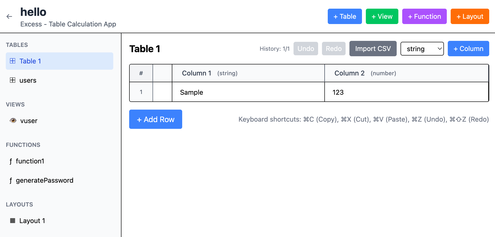

# Excess - Table Calculation App

A unique table calculation application that focuses on function-based computations rather than traditional cell formulas. Built with SolidJS, TypeScript, and Bun.



## Features

### 🗂️ Core Components

- **Tables**: Spreadsheet-like data tables with type-aware columns
- **Views**: SQL-like queries to filter and join tables
- **Functions**: Reusable JavaScript functions for calculations
- **Layouts**: Free-form canvas for arranging tables, views, and charts

### ⚡ Key Capabilities

- **Function-Based Calculations**: Unlike Excel, calculations are done through reusable functions, not cell formulas
- **Secure Sandbox Execution**: Functions run in a secure, isolated environment
- **Persistent Storage**: All data saved locally using IndexedDB
- **Multi-Project Support**: Create and manage multiple projects
- **Advanced Table Editing**:
  - Row numbers display
  - Cell range selection
  - Copy/Paste support (⌘C/⌘V)
  - Cut operation (⌘X)
  - Undo/Redo (⌘Z/⌘⇧Z)
  - CSV import
  - Column management (add, delete, rename)

### 🎯 Unique Design Philosophy

This is **NOT an Excel clone**. Key differences:

- Functions are standalone, reusable entities (not per-cell formulas)
- Tables focus on data structure with JSON-like typing
- Views provide SQL-like data transformation
- Layouts offer flexible visualization arrangements

## Getting Started

### Prerequisites

- Docker and Docker Compose
- OR Bun runtime (v1.0+)

### Running with Docker

```bash
# Development mode
docker compose up

# Access at http://localhost:5173
```

### Running with Bun

```bash
cd ui
bun install
bun run dev

# Access at http://localhost:5173
```

## Usage

### 1. Create a Project

Start by creating or selecting a project. All data is organized within projects.

### 2. Working with Tables

- Click **+ Table** to create a new table
- Double-click cells to edit
- Drag to select multiple cells
- Use keyboard shortcuts for efficient editing

### 3. Creating Views

Views allow SQL-like queries over your tables:

```sql
SELECT * FROM table1 WHERE amount > 100
SELECT name, SUM(sales) FROM data GROUP BY name
```

### 4. Writing Functions

Functions provide reusable calculations:

```javascript
// Example: Calculate tax
// Parameters: amount (number), rate (number)
return amount * (1 + rate / 100)
```

Functions can accept various parameter types:
- Basic types: `string`, `number`, `boolean`
- Data types: `table`, `view`, `rows`, `columns`

### 5. Building Layouts

- Drag tables/views from sidebar to layout canvas
- Elements snap to grid for precise alignment
- Resize by dragging corner handles

## Keyboard Shortcuts

| Shortcut | Action |
|----------|--------|
| ⌘C | Copy selected cells |
| ⌘X | Cut selected cells |
| ⌘V | Paste |
| ⌘Z | Undo |
| ⌘⇧Z | Redo |
| Double-click | Edit cell |
| Drag | Select range |
| Shift+Click | Extend selection |

## Architecture

```
src/
  models/      # TypeScript data models
  components/  # UI components
  services/    # Business logic
    database.ts         # IndexedDB persistence
    queryEngine.ts      # SQL query execution
    secureFunctionEngine.ts  # Sandboxed function execution
```

## Technology Stack

- **Frontend**: SolidJS + TypeScript
- **Styling**: Tailwind CSS
- **Build**: Vite + Bun
- **Storage**: IndexedDB
- **Container**: Docker with Alpine Linux

## Development

### Project Structure

- `/ui` - Frontend application
- `/compose.yaml` - Docker Compose configuration
- `/PLAN.md` - Development roadmap

### Building for Production

```bash
cd ui
bun run build
# Output in ui/dist/
```

### Docker Build

```bash
docker compose build
docker compose up -d
```

## Roadmap

See [PLAN.md](PLAN.md) for detailed development plans and missing features.

## Contributing

This is a private project, but key design principles for any modifications:

1. **Not Excel**: Avoid cell-formula patterns
2. **Function-First**: Calculations through reusable functions
3. **Type-Aware**: Respect JSON-like type system
4. **Secure**: Maintain sandbox boundaries

## License

Private project - All rights reserved